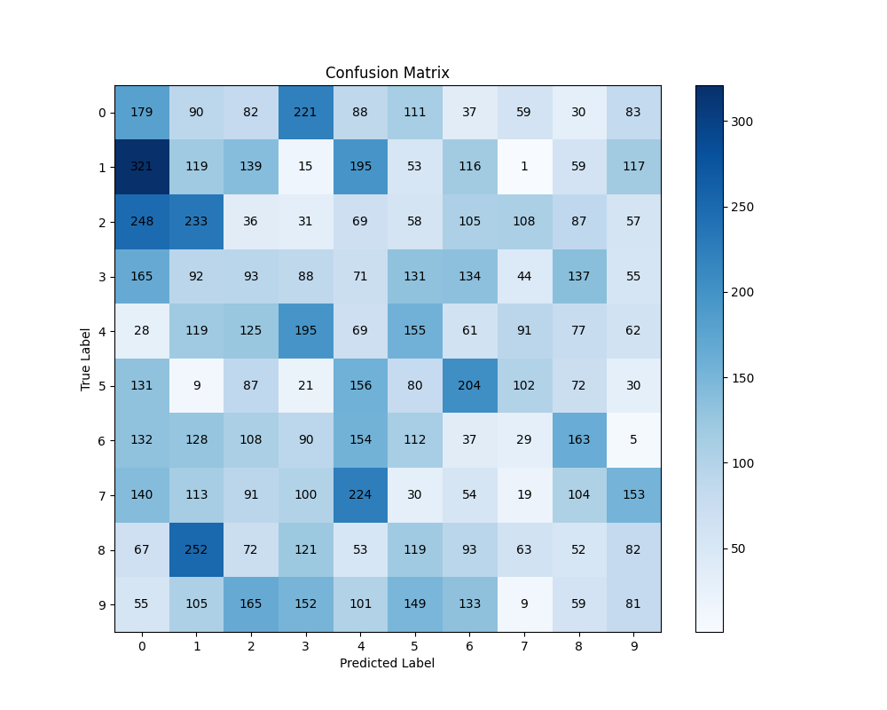
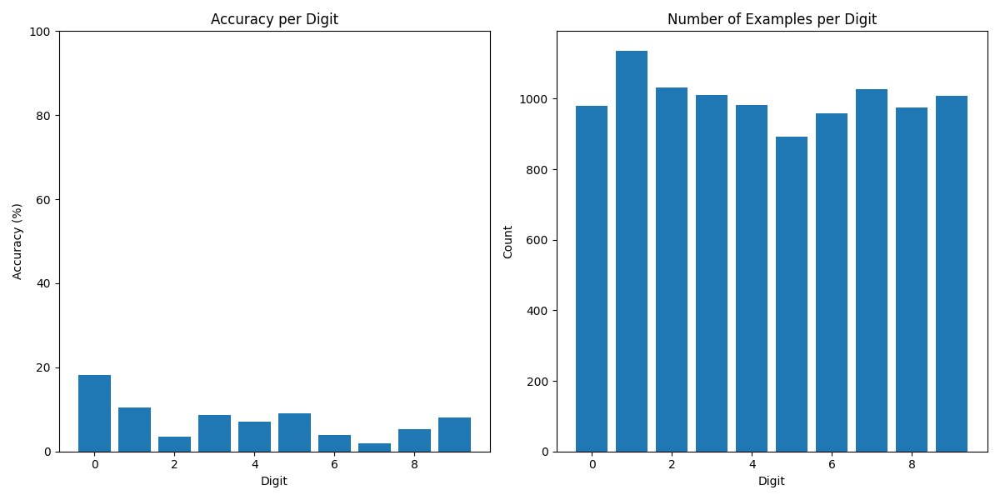

# Results Interpretation Guide

This document explains how to interpret the results generated during network training and testing, particularly focusing on the visualizations saved in the `results` directory.

## Results Directory Structure

```
results/
├── confusion_matrix.png        # Classification performance matrix
└── accuracy_per_digit.png      # Per-digit accuracy analysis

Additional files that may be generated during training:
├── input_weights_evolution/    # Weight evolution during training
├── weight_maps/               # Final weight maps
└── neuron_assignments/        # Neuron specialization maps
```

## Weight Visualizations

### Input Weight Maps (`weight_maps/*.png`)

### Weight Evolution Images

When generated, these images show the learned input weights for each excitatory neuron:
- **Format**: 20x20 grid of 28x28 patches
- **Interpretation**:
  - Each patch represents weights for one excitatory neuron
  - Brighter pixels indicate stronger weights
  - Dark pixels indicate weak or inhibitory connections
  - Look for digit-like patterns in patches
  - Well-trained neurons show clear digit features

### Weight Evolution (`input_weights_evolution/*.png`)

These images show how weights evolve during training:
- **Sequence**: Multiple images numbered by training iteration
- **Changes to look for**:
  - Initial random weights → organized patterns
  - Emergence of digit-like features
  - Specialization of different neurons

## Performance Analysis

### Confusion Matrix (`confusion_matrix.png`)



Represents classification performance:
- **Rows**: True labels (0-9)
- **Columns**: Predicted labels (0-9)
- **Color intensity**: Number of examples
- **Interpretation**:
  - Diagonal elements: Correct classifications
  - Off-diagonal elements: Misclassifications
  - Brighter colors indicate higher counts

### Performance Plot (`accuracy_per_digit.png`)



Shows classification accuracy over time:
- **X-axis**: Training/testing iterations
- **Y-axis**: Accuracy percentage
- **Features to observe**:
  - Learning curve shape
  - Convergence point
  - Stability of performance

## Neuron Activity

### Neuron Assignments (`neuron_assignments/*.png`)

Visualizes which neurons respond to which digits:
- **Color coding**: Each digit has unique color
- **Interpretation**:
  - Clusters of same color: Neurons specialized for same digit
  - Mixed colors: Less specialized neurons
  - White spaces: Inactive neurons

### Activity Raster Plots (`raster_plots/*.png`)

Shows spike timing patterns:
- **X-axis**: Time
- **Y-axis**: Neuron index
- **Dots**: Individual spikes
- **Patterns to look for**:
  - Temporal clustering
  - Response selectivity
  - Inhibition effects

## Example Interpretation

### Good Training Results Show:
1. Weight maps:
   - Clear digit-like patterns
   - Diverse feature representations
   - Sharp, well-defined weights

2. Confusion matrix:
   - Strong diagonal (bright)
   - Weak off-diagonal elements (dark)
   - Balanced performance across digits

3. Performance plot:
   - Smooth learning curve
   - High final accuracy (>90%)
   - Stable performance

### Common Issues:

1. Poor Learning Signs:
   - Blurry or noisy weight patterns
   - Uniform or random-looking weights
   - Many inactive neurons

2. Performance Problems:
   - High confusion between similar digits (e.g., 3/8, 4/9)
   - Unstable accuracy
   - Low overall performance

3. Network Issues:
   - Over-specialization (few active neurons)
   - Under-specialization (no clear patterns)
   - Excessive inhibition (sparse activity)

## Analysis Tools

### Quick Analysis Script
```bash
python analyze_results.py
```
Provides summary statistics:
- Overall accuracy
- Per-digit accuracy
- Confusion matrix
- Active neuron count

### Detailed Analysis
```bash
python detailed_analysis.py --results-dir results/
```
Generates comprehensive report:
- Weight pattern analysis
- Temporal response analysis
- Network efficiency metrics
- Learning dynamics analysis

## Best Practices

1. Regular Monitoring:
   - Save results at fixed intervals
   - Compare with previous runs
   - Track multiple metrics

2. Validation:
   - Check both training and test results
   - Verify with different test sets
   - Compare with baseline performance

3. Troubleshooting:
   - Examine weight patterns first
   - Check neuron activity distribution
   - Verify learning rule effects

## Common Patterns

### Successful Learning:
1. Weight maps show:
   - Clear digit features
   - Diverse representations
   - Sharp boundaries

2. Performance shows:
   - Steady improvement
   - High final accuracy
   - Good generalization

### Learning Issues:
1. Weight problems:
   - Blurry patterns
   - Uniform weights
   - Missing features

2. Performance problems:
   - Unstable learning
   - Poor generalization
   - Digit confusion